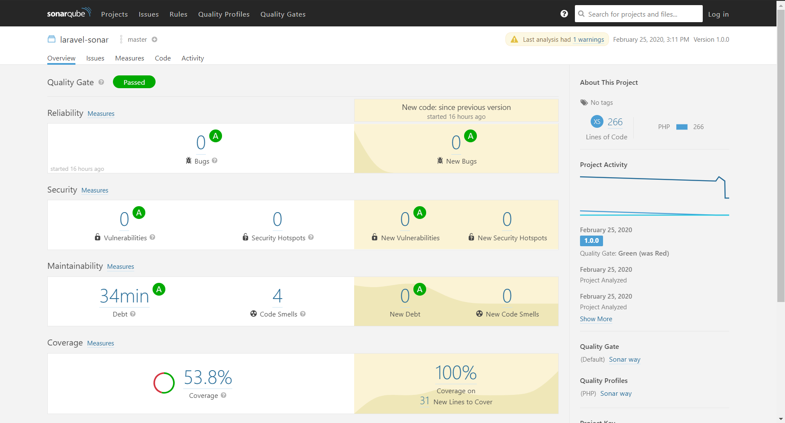
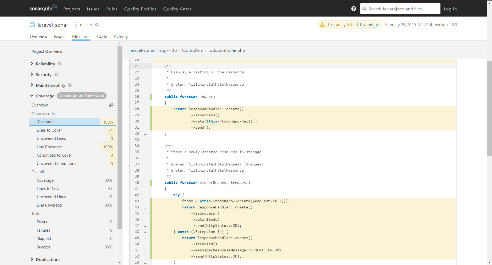

# Laravel Sonarqube
## Sonarqube configuration for Laravel framework

Tutorial
- Install sonarqube and run it on port 9000
- Install sonar scanner and add it to your path
- Run phpunit using ```./vendor/bin/phpunit``` command on Linux <br>
  or ```vendor\bin\phpunit``` on Windows
- Run sonar scanner using `sonar-scanner` command
- Check your sonarqube web interface

Configuration file:
- ./phpunit.xml
- ./sonar-project.properties

Example test case:
- ./tests/

Example PHPUnit coverage report:
- ./ci/coverage.xml

Screenshot:

